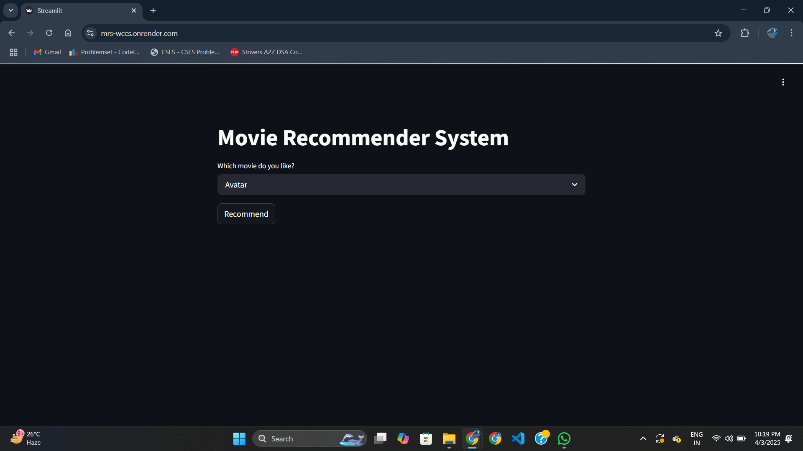
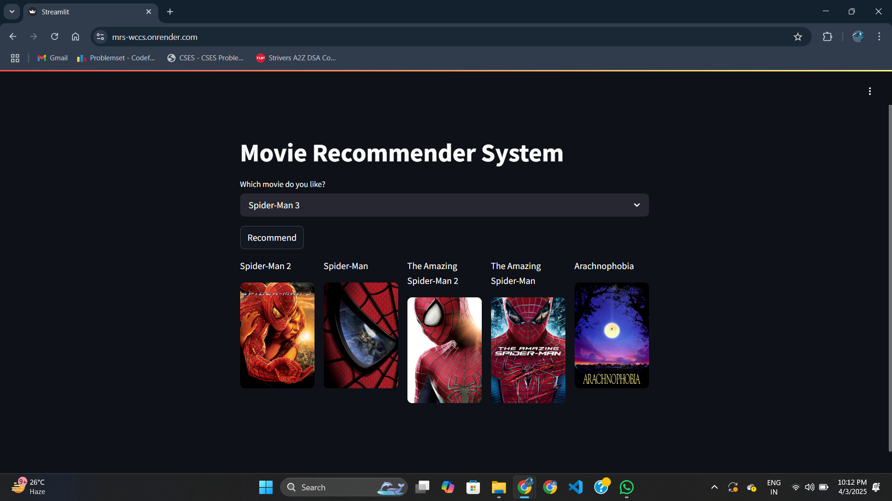

# 🎬Movie Recommender System

# 📌Overview
A Movie Recommendation System built using Python, Streamlit, and Machine Learning. It suggests movies based on user preferences using content-based filtering and collaborative filtering techniques.

# 🚀 Features
1️⃣ Search for movies and get personalized recommendations

2️⃣ Uses cosine similarity to find similar movies

3️⃣ Built with Python, Pandas, Scikit-learn, and Streamlit

4️⃣ Simple and interactive web interface

# 🛠 Tech Stack
Frontend: Streamlit

Backend: Flask (optional)

Machine Learning: Scikit-learn, Pandas, NumPy

Database: CSV-based dataset

# 🎮 How to Use 
1️⃣ Open the App

If running locally, open your browser and go to http://localhost:8501

or visit https://mrs-wccs.onrender.com

2️⃣ Search for a Movie

Type the name of a movie in the search bar

Select the movie from the dropdown list

3️⃣ Get Recommendations

Click "Recommend"

The system will display similar movies along with posters based on the selected movie

4️⃣ Explore More

Try searching for different genres or favorite movies

Click on suggested movies to get more recommendations

# 🖼 Screenshots

# 📥 Installation

1️⃣ Clone the repository

git clone https://github.com/yourusername/movie-recommender-system.git

cd movie-recommender-system

2️⃣ Create a virtual environment

python -m venv venv

source venv/bin/activate  # On Mac/Linux

venv\Scripts\activate      # On Windows

3️⃣ Install dependencies

pip install -r requirements.txt

# 🎬 How to Run

Streamlit Version

streamlit run app.py

# 📡 Deployment

Deploy on Render

1️⃣Push your code to GitHub

2️⃣Connect Render to your GitHub repository

3️⃣Set the Start Command as:

streamlit run app.py --server.port $PORT --server.address 0.0.0.0

4️⃣Click Deploy 

# 🎓 Dataset Used

TMDB 5000 Movie Dataset

https://www.kaggle.com/datasets/tmdb/tmdb-movie-metadata?resource=download

# 🙌 Contributing

Feel free to submit issues, feature requests, or pull requests!
